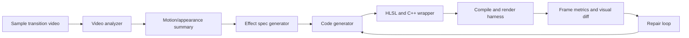

# AI HLSL Transition Agent Design

## Goal

Given a short sample transition video, generate a transition implementation that can run inside this repository's `OverlayTrPlugInFx` pipeline.

## Repo-specific constraints

This codebase does not consume raw HLSL directly as the final runtime artifact.

- `OverlayTrEngine/PlugInFxManager.cpp` loads `OverlayTrPlugInFx.dll` and drives effects through `SetFx`, `SetBuffer`, and `Render(progress)`.
- `OverlayTrPlugInFx/OverlayTrPlugInFx.cpp` selects a concrete C++ effect class by ID.
- Effects inherit from `CFxBase` in `OverlayTrPlugInFx/FxBase.h`.
- Each effect usually provides:
  - one or more HLSL shaders
  - a packed constant buffer layout shared by C++ and HLSL
  - optional resource loading logic
  - custom render sequencing when one shader pass is not enough

Because of that, the agent should not be designed as:

- input video -> HLSL text only

It should be designed as:

- input video -> structured effect spec -> validated HLSL + C++ wrapper skeleton

## Recommended system boundary

Design the first version to generate only a restricted class of effects:

- single-pass fullscreen pixel shader transitions
- inputs: `TextureA`, `TextureB`, `progress`, `uv`
- output: one RGBA frame
- no external image resources
- no multi-pass blur/composite pipeline
- no geometry changes beyond the existing fullscreen quad

This matches the easiest path in `CFxBase` and avoids harder cases like `TrCamcorder` and `TrGlitch` that need extra textures, custom scheduling, or multiple shaders.

## Target artifact model

The agent should output these artifacts:

1. `effect_spec.json`
2. `transition_ps.hlsl`
3. `TransitionName.h`
4. `TransitionName.cpp`
5. `eval_report.json`

`effect_spec.json` is the canonical contract. Everything else is derived from it.

Example shape:

```json
{
  "name": "SoftDirectionalWipe",
  "class_name": "CTrSoftDirectionalWipe",
  "fx_id": "AI_SoftDirectionalWipe",
  "category": "single_pass",
  "inputs": ["TextureA", "TextureB"],
  "uniforms": [
    { "name": "progress", "type": "float", "range": [0.0, 1.0] },
    { "name": "angle", "type": "float", "range": [0.0, 6.28318] },
    { "name": "softness", "type": "float", "range": [0.001, 0.5] }
  ],
  "visual_primitives": ["wipe", "edge_softening"],
  "safety_rules": {
    "allow_loops": true,
    "allow_external_resources": false,
    "allow_multi_pass": false
  }
}
```

## End-to-end architecture



## Four-agent design

Use separate agents with narrow responsibilities instead of one large prompt.

### 1. Analyzer agent

Input:

- sample video
- sampled frames
- optional optical flow or segmentation data

Output:

- transition family classification
- estimated timing curve
- foreground/background behavior summary
- likely visual primitives
- confidence scores

Suggested output fields:

- `transition_family`: wipe, dissolve, glitch, zoom, blur, displacement, stripe, particle-like
- `symmetry`: none, horizontal, vertical, radial
- `motion_direction`: left_to_right, right_to_left, inward, outward, mixed
- `blend_pattern`: hard_cut, soft_mix, masked_mix, displaced_mix
- `artifact_pattern`: rgb_split, noise, scanline, blur, shake

This stage should describe the effect, not generate code.

### 2. Spec agent

Input:

- analyzer output
- allowed runtime subset
- examples from your repo

Output:

- normalized `effect_spec.json`
- candidate parameter set
- candidate shader recipe

This is where you constrain creativity. The spec agent must choose from a fixed grammar of transition building blocks.

### 3. Codegen agent

Input:

- `effect_spec.json`
- template examples from `OverlayTrPlugInFx`

Output:

- HLSL pixel shader
- matching C++ constant buffer struct
- minimal `CFxBase` subclass
- factory registration snippet

For v1, make this agent fill templates, not write effect classes from scratch.

### 4. Critic/repair agent

Input:

- compiler errors
- render failures
- frame similarity metrics
- style/rule violations

Output:

- targeted edits to spec or code

This agent should never invent a brand new effect family. It only repairs the current candidate.

## Harness design

The harness should be deterministic and executable without UI.

### Inputs

- source clip A
- source clip B
- reference transition clip
- generated effect spec
- generated shader package

### Steps

1. Normalize all videos to the same resolution, frame rate, and duration.
2. Extract transition frames from the reference clip.
3. Render the generated transition frame-by-frame with your engine.
4. Compare generated frames against reference frames.
5. Produce structured metrics and thumbnails.

### Metrics

Use a mix of simple and learned metrics.

- `MSE` or `L1` per frame
- `SSIM`
- edge difference
- optical-flow consistency
- CLIP or video-embedding similarity on sampled frames

Do not optimize only for pixel loss. Many transitions are perceptually similar but not pixel-identical.

### Pass/fail gates

- shader compiles
- no NaN or invalid texture access symptoms
- runtime stays within frame budget
- visual score clears threshold
- output follows allowed effect subset

## Recommended implementation split

Use Python for orchestration and evaluation, and keep rendering in the existing C++ engine.

Suggested `harness` layout:

```text
harness/
  README.md
  requirements.txt
  configs/
    allowed_effects.yaml
    eval_thresholds.yaml
  prompts/
    analyzer.md
    spec_agent.md
    codegen_agent.md
    critic.md
  examples/
    effect_specs/
  src/
    main.py
    pipeline.py
    video_io.py
    feature_extract.py
    spec_schema.py
    codegen.py
    validator.py
    evaluator.py
    report.py
  work/
  outputs/
```

## Core design decision: retrieval over training first

Do not start by fine-tuning a model on your shaders.

Start with retrieval-augmented generation:

- index existing transitions in `OverlayTrPlugInFx`
- store for each effect:
  - HLSL source
  - C++ wrapper
  - parameter struct
  - short natural-language description
  - tags like `glitch`, `blur`, `overlay`, `multi_pass`
- retrieve the closest 2 to 5 examples before generation

This matters because your repo already contains the coding patterns the model must imitate.

## Effect grammar for v1

Limit generation to a composable grammar such as:

- blend: `lerp(A, B, mask)`
- mask source: linear gradient, radial distance, noise threshold, stripe pattern
- UV transform: translate, scale, rotate, small displacement
- edge shaping: smoothstep, easing curve, feather width
- color artifact: rgb split, brightness pulse, scanline modulation

If the sample video cannot be approximated by this grammar, the harness should say so instead of forcing low-quality code.

## Practical prompt strategy

The codegen agent should receive:

- one fixed HLSL template
- one fixed C++ wrapper template
- one JSON schema for the spec
- 2 to 5 retrieved examples
- explicit forbidden constructs

Example rules:

- keep one pixel shader entry point
- use `TextureA`, `TextureB`, `samLinear`, `PS_INPUT`
- constant buffer layout must match the C++ struct exactly
- no dynamic resource loading
- no undefined helper functions
- clamp or saturate all final UV sampling

## Validation pipeline

Run validation in this order:

1. JSON schema validation for `effect_spec.json`
2. static policy validation against allowed subset
3. HLSL compile check
4. C++ wrapper compile check
5. render smoke test on synthetic clips
6. visual evaluation against the sample transition

The agent loop should stop early on the first hard failure.

## Data creation strategy

You do not have supervised pairs of:

- input transition video -> desired shader

So build a synthetic dataset from your own engine first.

### Phase 1

Render many clips from existing effects with randomized parameters.

For each sample, save:

- rendered video
- effect ID
- parameter values
- HLSL file name
- effect family tags

This gives you a controlled benchmark and lets the analyzer/spec stages learn to map video back into a known effect family.

### Phase 2

Allow parameter interpolation and small spec edits.

### Phase 3

Only then attempt novel effect synthesis.

## What the first milestone should be

A realistic first milestone is not:

- any arbitrary transition video -> production-ready custom shader

It is:

- transition video that resembles an existing single-pass family -> recovered effect family + parameterized shader close enough to pass review

That is tractable.

## Failure modes to design for

- sample video contains compositing not expressible by a single shader pass
- motion is caused by edited source clips, not the transition itself
- timing curve is ambiguous
- analyzer overfits to content instead of transition behavior
- generated constant buffer layout mismatches HLSL packing
- effect visually matches but violates performance budget

## Suggested rollout

### Stage 1

Build a non-AI harness that:

- renders known effects
- scores them against reference clips
- emits reports

### Stage 2

Add analyzer + retrieval to classify a sample into an existing effect family.

### Stage 3

Add spec generation for the restricted single-pass grammar.

### Stage 4

Add code generation into templates.

### Stage 5

Add repair loop from compile and eval failures.

## Recommendation for this repo

For this repository, the cleanest path is:

1. Build a Python harness in `harness/`.
2. Expose a command-line renderer for one transition effect at a time.
3. Start with only single-pass effects derived from `CFxBase`.
4. Use retrieval from existing effects before attempting novel generation.
5. Treat HLSL generation as a constrained code synthesis problem, not open-ended text generation.

If you want, the next concrete step is to scaffold the `harness` folder with:

- a schema for `effect_spec.json`
- a Python evaluation pipeline
- prompt templates for analyzer/spec/codegen/critic
- a first restricted shader template that targets `CFxBase`